> 本笔记为sql自学习笔记
> [引用笔记详细见此链接](https://www.zhihu.com/collection/585356510)
> [W3School学习网站](https://www.w3school.com.cn/sql/index.asp)

# 一、连接查询
```sql
SELECT columns_name       --查找字段
FROM Table                --目标表
WHERE condition           --过滤条件
GROUP BY columns_name     --按列值分组，可以1个或多个列
HAVING condition          --分组后的筛选条件，HAVING与WHERE区别在于前者表达式中可包含函数
ORDER BY columns_name     --根据指定的列对结果集进行排序，默认按照升序，降序 ORDER BY DESC
LIMIT start, row_count    --按条件取数据，start开始行号，row_count限制条数。注意:初始记录行的偏移量是 0(而不是 1)
```
eg：
```sql
# 取第二大的数据
SELECT emp_no,salary
FROM salaries 
WHERE to_date='9999-01-01' 
ORDER BY salary DESC 
LIMIT 1,1
```
  
eg：
```sql
# 分组后继续查询
SELECT user_name 
AS 用户, COUNT(id) AS 下单数量 
FROM `Order` 
GROUP BY user_id 
HAVING COUNT(id)>2;
```

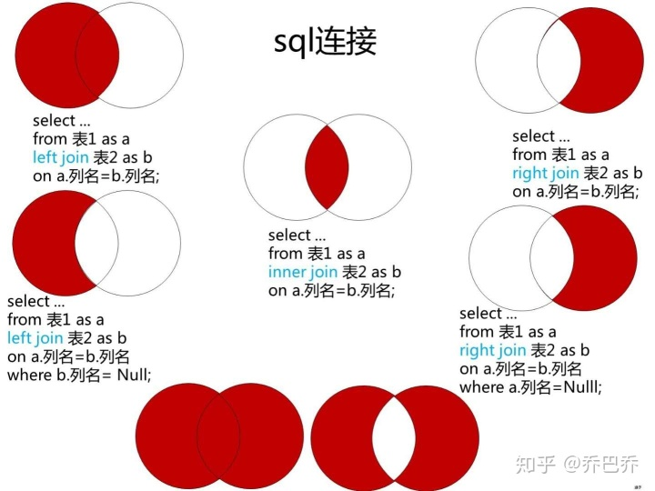

- INNER JOIN 两边表同时有对应的数据，即任何一边缺失数据就不显示。
LEFT JOIN 会读取左边数据表的全部数据，右边表无对应则为NULL。
RIGHT JOIN 会读取右边数据表的全部数据，左边表无对应则为NULL。
## 1、内连接(INNER JOIN)
取数图例：
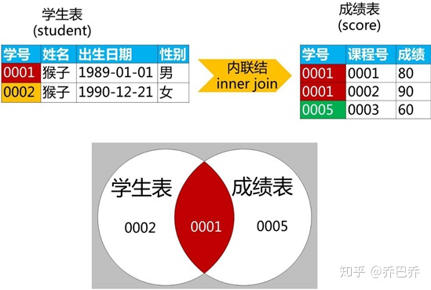
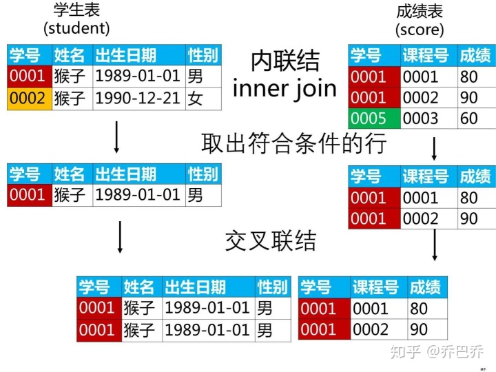
```sql
SELECT A.学号, A.姓名, B.课程号
FROM student AS A INNER JOIN score as B
ON A.学号 = B.学号;
```
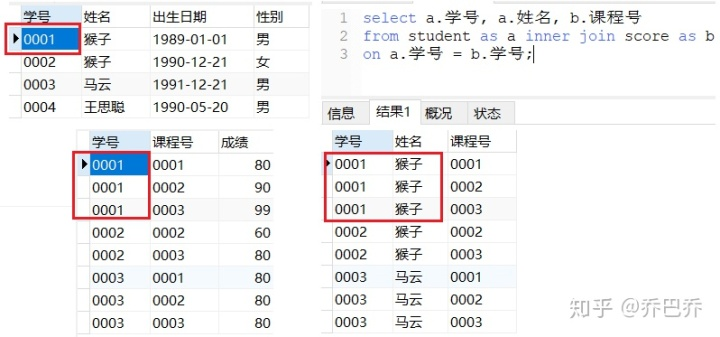

## 2、左连接（LEFT JOIN）
取数图例：
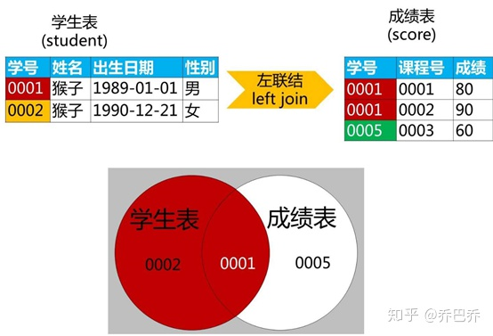
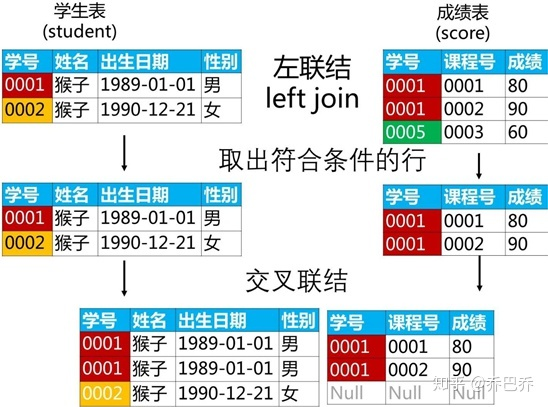
```sql
SELECT A.学号, A.姓名, B.课程号
FROM student AS A LEFT JOIN score AS B
ON A.学号 = B.学号;
```
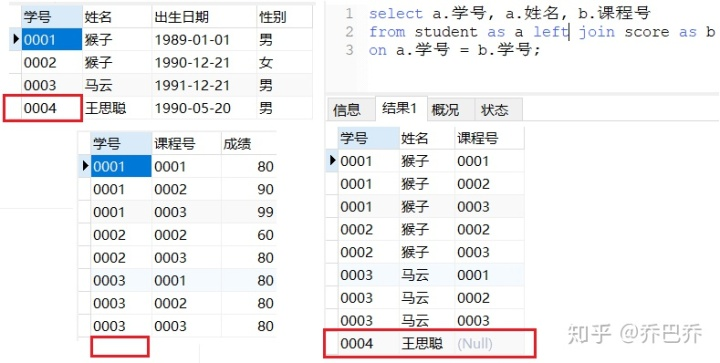

```sql
SELECT A.学号, A.姓名, B.课程号
FROM student AS A LEFT JOIN score AS B
ON A.学号 = B.学号;
WHERE B.学号 IS NULL
```


## 3、右连接(RAIGHT JOIN)
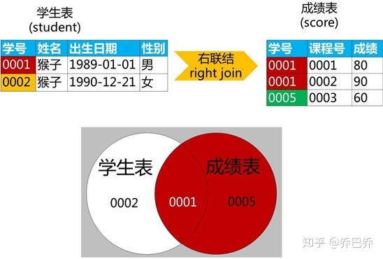
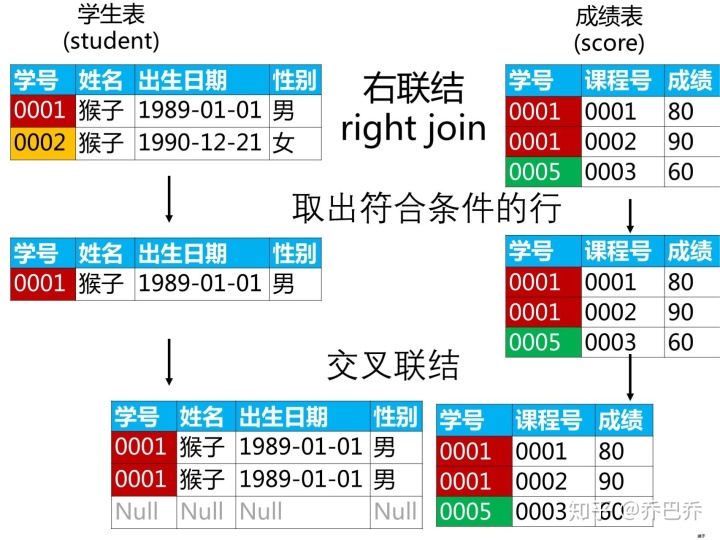
```sql
SELECT A.学号, A.姓名, B.课程号
FROM student AS A RIGHT JOIN score AS B
ON A.学号 = B.学号;
```
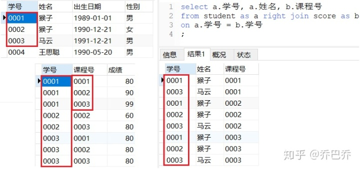
SQL语句：去掉交集部分
```SQL
SELECT A.学号, A.姓名, B.课程号
FROM student AS A RIGHT JOIN score AS B
ON A.学号 = B.学号;
WHERE A.学号 IS NULL;
```
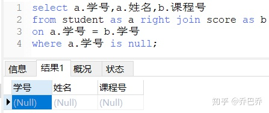


# 分页查询
```sql
# 每5行一页，返回第2页的数据
SELECT * FROM employees LIMIT 5,5
# select * from table limit (start-1)*limit,limit; 其中start是页码，limit是每页显示的条数。
SELECT * FROM employees LIMIT (2-1)*5,5
```


# 函数
1、取最大值（MAX ）
```sql
SELECT MAX(hire_date) FROM employees
```
2、替换（REPLACE)

```SQL
# REPLACE(original-string，search-string，replace-string)
# original-string： 被搜索的字符串。
# search-string： 要搜索并被 replace-string 替换的字符串。 
# replace-string： 该字符串用于替换 search-string。
UPDATE `titles_test`
SET emp_no = REPLACE(emp_no,'10001','10005') 
WHERE id=5 AND emp_no=10001
```

3、 截取字段中某个字符（SUBSTR）
```sql
# SUBSTR(string,start,[len])
# string是要截取的字符串
# start是字符串的起始位置，±(1~length(string))，当start=length(string)，截取最后一个字符;当start=-n时，从倒数第n个字符处截取。
# len是要截取字符串的长度，若len省略，则从start处截取到字符串末尾；若len大于剩下的字符串长度，也是截取到字符串末尾为止。
SELECT first_name
FROM Employees
ORDER BY SUBSTR(first_name,-2)
```

4、连接函数（group_concat）

```sql
# group_concat(x[,y])，连接函数。y为x值之间的连接符，默认为逗号。
SELECT dept_no, group_concat(emp_no) AS employees
FROM dept_emp
GROUP BY dept_no
```

5、排名函数（RANK）

```sql
# ROW_NUMBER
# over子句选择对某一列进行排序生成序号，1，2，3，4，5...
SELECT ROW_NUMBER() OVER(ORDER BY [UserId] DESC) AS rank,* FROM [Order]

# RANK
# 1,1,3,3,3,6,6,8...
SELECT RANK() OVER(ORDER BY [UserId] DESC) AS rank,* FROM [Order]

# DENSE_RANK
# 1,2,2,2,3,3,...
SELECT DENSE_RANK() OVER(ORDER BY [UserId] DESC) AS rank,* FROM [Order]

# NTILE
# 6行数据：1,1,2,2,3,4。ntile函数可以对序号进行分组处理，将有序分区中的行分发到指定数目的组中。
SELECT NTILE(4) OVER(ORDER BY [UserId] DESC) AS rank,* FROM [Order]
```
[具体使用方法见此链接](https://www.cnblogs.com/52XF/p/4209211.html)

6、字符串连接（CONCAT）
```sql
SELECT CONCAT('FIRST ', 'SECOND')

# 连接员工ID、name、work_date
SELECT CONCAT(id, name, work_date)
FROM employee_tbl;
```

7、舍小数位
```sql
SELECT ROUND(字段名,小数位) 
FROM table_name
```

8、IFNULL
```sql
# 参数1不为NULL，返回参数1；否则返回参数2
IFNULL(参数1,参数2);
```

9、CASE函数/CASE搜索函数
```sql
# CASE函数
CASE sex
     WHEN '1' THEN '男'
     WHEN '2' THEN '女'
     ELSE '其他' 
END
# Case搜索函数 
CASE 
     WHEN sex = '1' THEN '男' 
     WHEN sex = '2' THEN '女' 
     ELSE '其他' 
END 
# 注意：Case函数只返回第一个符合条件的值，剩下的Case部分将会被自动忽略。
```


### EXISTS关键字
```sql
# 使用含有关键字exists查找未分配具体部门的员工的所有信息
SELECT * 
FROM employees
WHERE NOT EXISTS (
     SELECT emp_no
     FROM dept_emp
     WHERE employees.emp_no= dept_emp.emp_no
)
```

### 查询字符中某指定字符的个数
```sql
# 思路：原字符串长度 - 将原字符串中要统计的字符替换成空的长度
# 查找字符串'1000000000000000000000000000000000000000000000000000000000000000000000000000000,A,B' 中逗号','出现的次数cnt
SELECT length('10,A,B') - length(replace('10,A,B',',',''))
```
### 强制指定索引查询（FORCE）
```sql
# SQLite
SELECT * FROM 表名 INDEXED BY 索引名 WHERE 条件
# MySQL
SELECT * FROM 表名 FORCE INDEX（索引名） WHERE 条件
```


