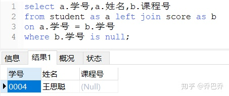

> 本笔记为sql自学习笔记
> 参考https://www.zhihu.com/collection/585356510

# 一、连接查询
```sql
SELECT columns_name       --查找字段
FROM Table                --目标表
WHERE condition           --过滤条件
GROUP BY columns_name     --按列值分组，可以1个或多个列
HAVING condition          --分组后的筛选条件，HAVING与WHERE区别在于前者表达式中可包含函数
ORDER BY columns_name     --根据指定的列对结果集进行排序，默认按照升序，降序 ORDER BY DESC
LIMIT start, row_count    --按条件取数据，start开始行号，row_count限制条数。注意:初始记录行的偏移量是 0(而不是 1)
```
eg：
```sql
# 取第二大的数据
SELECT emp_no,salary
FROM salaries 
WHERE to_date='9999-01-01' 
ORDER BY salary DESC 
LIMIT 1,1
```
  
eg：
```sql
# 分组后继续查询
SELECT user_name 
AS 用户, COUNT(id) AS 下单数量 
FROM `Order` 
GROUP BY user_id 
HAVING COUNT(id)>2;
```


- INNER JOIN 两边表同时有对应的数据，即任何一边缺失数据就不显示。
LEFT JOIN 会读取左边数据表的全部数据，右边表无对应则为NULL。
RIGHT JOIN 会读取右边数据表的全部数据，左边表无对应则为NULL。
## 1、内连接(INNER JOIN)
取数图例：


```sql
SELECT A.学号, A.姓名, B.课程号
FROM student AS A INNER JOIN score as B
ON A.学号 = B.学号;
```


## 2、左连接（LEFT JOIN）
取数图例：


```sql
SELECT A.学号, A.姓名, B.课程号
FROM student AS A LEFT JOIN score AS B
ON A.学号 = B.学号;
```


```sql
SELECT A.学号, A.姓名, B.课程号
FROM student AS A LEFT JOIN score AS B
ON A.学号 = B.学号;
WHERE B.学号 IS NULL
```



## 3、右连接(RAIGHT JOIN)


```sql
SELECT A.学号, A.姓名, B.课程号
FROM student AS A RIGHT JOIN score AS B
ON A.学号 = B.学号;
```

SQL语句：去掉交集部分
```SQL
SELECT A.学号, A.姓名, B.课程号
FROM student AS A RIGHT JOIN score AS B
ON A.学号 = B.学号;
WHERE A.学号 IS NULL;
```


# 函数
- MAX 取最大值 eg：SELECT MAX(hire_date) FROM employees
- replace(original-string，search-string，replace-string)
  - original-string： 被搜索的字符串。可为任意长度。 
  - search-string： 要搜索并被 replace-string 替换的字符串。该字符串的长度不应超过 255 个字节。如果 search-string 是空字符串，则按原样返回原始字符串。 
  - replace-string： 该字符串用于替换 search-string。可为任意长度。如果 replacement-string 是空字符串，则删除出现的所有 search-string。
```SQL
UPDATE `titles_test`
SET emp_no = REPLACE(emp_no,'10001','10005') 
WHERE id=5 AND emp_no=10001
```

## 表操作
```sql 
# 重命名：
ALTER TABLE titles_test RENAME TO titles_2017;
```

## 创建视图
视图无非就是存储在数据库中并具有名字的 SQL 语句，或者说是以预定义的 SQL 查询的形式存在的数据表的成分。，一种虚拟的表.
```sql
CREATE VIEW view_name AS
SELECT column1, column2.....
FROM table_name
WHERE [condition];
```